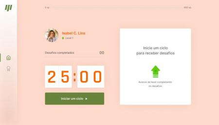
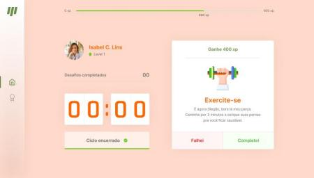

## NLW4 - MOVE.IT App


 

 

Aluno: Brenno

#### Tabela de cores

```css
:root {
    --bg-screen-intro: rgba(54, 104, 14, 0.75);
    --background: rgba(255, 211, 192, 0.85);
    --gray-line: rgba(220, 221, 224, 1);

    --completed-btn: rgba(98, 205, 15, 1);
    --completed-hover-btn: rgba(147, 238, 127, 0.308);

    --failed-btn: rgba(255, 1, 0, 1);
    --falied-hover-btn: rgba(247, 113, 113, 0.3);
    
    --hover-btb: rgba(121, 216, 0, 0.29);
    
    --text: rgba(102, 102, 102, 1);
    --text-title: rgba(255, 100, 0, 1);
    --text-sub-title: rgb(35, 85, 21);
    --text-white: rgba(255, 255, 255, 1);
}

```


### aula - 01 Trilha ReactJS
- [x] Configuração do ambiente de desenvolvimento
- [x] O que é reacJS
- [x] Instalação e configuração do ReactJS
- [x] Typescript
- [x] Criar projeto com ReactJS
- [x] Componentes
- [x] Estado
- [x] Propriedade
- [x] Add font externa
- [x] responsividade
- [x] codigo do desafio da aula-01 "#rumoaoproximonivel"

### aula - 02
- [x] Next.js
- [x] SPA, SSR, SSG
    - O que é SPA(Single Page Aplication)
    - SSR Server Side Rendering
    - SSG 
- [x] Comparando (create-react-app, gatsby, nextjs)
    - Create-react-app muito bom pra SPA
    - Gatsby muito bom para blogs e web sites que o conteudo não muda muito
    - NextJS é um conjunto de de SPA, SSR e SSG
- [x] Migra projeto para NextJS
- [x] Componente: Perfil
- [x] Componente: CompletedChalleges
- [x] Componente: Countdown
- [x] Criando hook de countdown
- [x] Código do desafio aula-02: "#jornadainfinita"

### Aula-03

- [x] Finalizar countdown
- [x] Componente: ChallengeBox
- [x] Contexto de desafios
- [x] Regras de negocio
- [x] Codigo do desafio aula-03: "#focopraticagrupo"

### Aula-04

- [x] Estrutura de level
- [x] Notificação web
- [x] Tocando audio no desafio
- [x] Código aula-04: "#neverstoplearning"

### Aula-05

-[x]
-[x] Modal level up
-[x] Código da aula-05: "#missincomplete"

