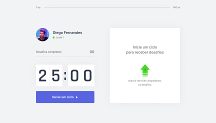
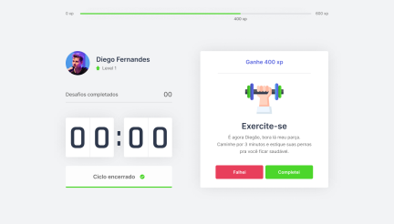

# NLW4 - Moveit App

 

Aluno: Brenno

### aula - 01 Trilha ReactJS
- [x] Configuração do ambiente de desenvolvimento
- [x] O que é reacJS
- [x] Instalação e configuração do ReactJS
- [x] Typescript
- [x] Criar projeto com ReactJS
- [x] Componentes
- [x] Estado
- [x] Propriedade
- [x] Add font externa
- [x] responsividade
- [x] codigo do desafio da aula-01 "#rumoaoproximonivel"

### aula - 02
- [x] Next.js
- [x] SPA, SSR, SSG
    - O que é SPA(Single Page Aplication)
    - SSR Server Side Rendering
    - SSG 
- [x] Comparando (create-react-app, gatsby, nextjs)
    - Create-react-app muito bom pra SPA
    - Gatsby muito bom para blogs e web sites que o conteudo não muda muito
    - NextJS é um conjunto de de SPA, SSR e SSG
- [x] Migra projeto para NextJS
- [x] Componente: Perfil
- [x] Componente: CompletedChalleges
- [x] Componente: Countdown
- [x] Criando hook de countdown
- [x] Código do desafio aula-02: "#jornadainfinita"

### Aula-03

- [x] Finalizar countdown
- [x] Componente: ChallengeBox
- [x] Contexto de desafios
- [x] Regras de negocio
- [x] Codigo do desafio aula-03: "#focopraticagrupo"
